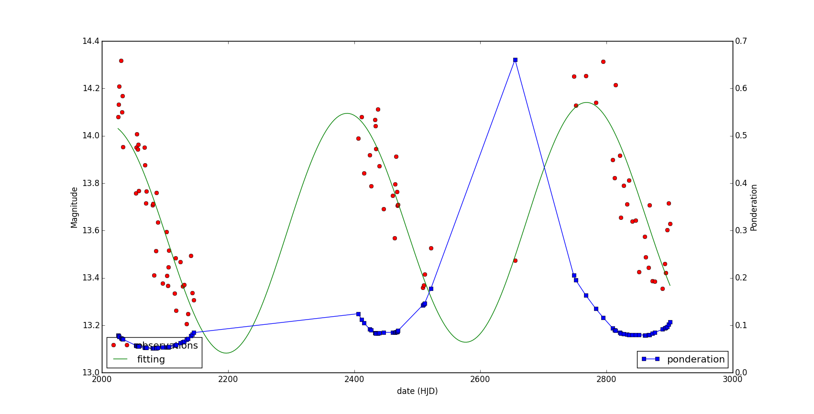

# varstarscan

Application to detect long term variable starts from series of data points.

This application is designed to receive a serie of points indicating the intensity of variable star candidates from a serie of observations distributed in time, with the following characteristics:

1. The data contains outliers.
2. The observations are very clustered, leaving big empty spaces.
3. Since only long term variable stars are taken into account, the data doesn't exceed 2-3 cycles.

The application returns a trigonometric function that fits the data points, also indicating the reliability of that regression.

The regressions have the following form:

# Dependencies

For the program to work the following python libraries are needed:

* numpy
* scipy
* mathplotlib

# Running test

For running `test.py` you must provide **.lc** files from the ASAS and put them on the `data` folder, on the current directory.

# Point ponderation formula

The point ponderation is the multiplication of the following functions:

1. Outlier ponderation:

  

  Where rho\_max is set to `3.5` and rho\_min to `2.5`.
  mu is the mean and sigma is standard desviation of the magnitudes.

2. Clustered ponderation:

  

  Where beta is the decay by clustering and is 10 for this application. Larger values imply that the ponderation decay due to near points propagates less.

# TODOs

* Add a function to calculate the likeliness of the fit.
* Find data of real long term variable stars (currently just using data from the ASAS).
* Evaluate the alternative fit form: 
* Evaluate if making the outlier-ponderation be according to the standard desviation of the line of a linear regression and not only the (constant) mean.
